# Advanced R packaging {data-background-color="#FFCD00"}

::: {.subtitle}

Building FAIR R packages for scientists

:::


## Program {.incremental}

-   How to package (briefly)
-   Quality of life setup
-   Building FAIR R packages
-   Packaging scientific code

# How to package

## All you need to know


Freely available at [r-pkgs.org](https://r-pkgs.org/)

## Minimal package infrastructure

-   DESCRIPTION: Metadata (maintainers, dependencies, license)

-   man: Help pages\*

-   NAMESPACE: Exported names\*

-   R: R code

\*usually automatically generated via `devtools` package

## Tutorials

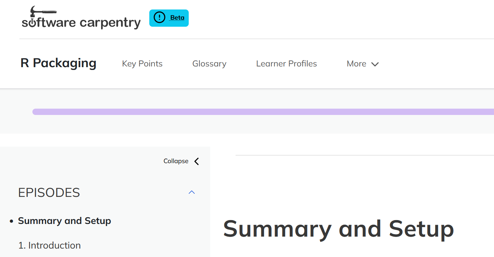 e.g., [carpentries](carpentries-incubator.github.io/lesson-R-packaging/) and [Utrecht University](github.com/UtrechtUniversity/tutorial-r-package/)

# Quality of life setup

All things that reduce mental load

Assuming the package is developed on GitHub

## Development workflow: `devtools`

::: top-right
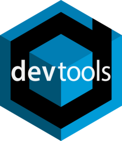
:::

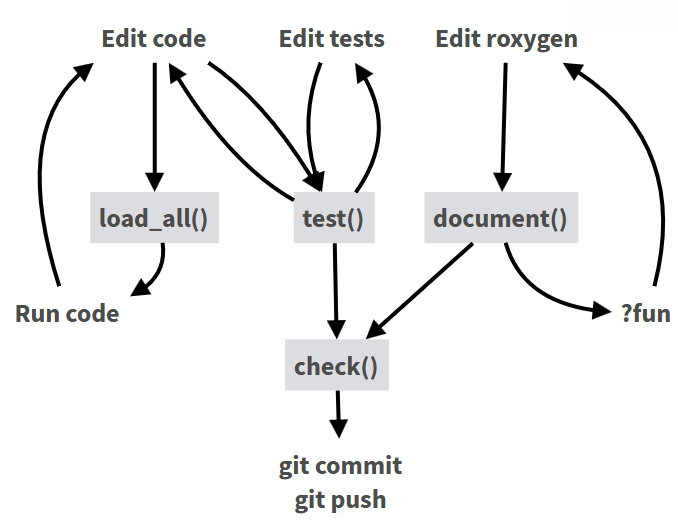

## Spellchecking: `spelling`

::: top-right

:::

-   Adds spellchecker to `devtools::check()`
-   Whitelist for technical terms

## Unit Testing

::: top-right
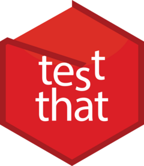
:::

Unit testing with `testthat`

<br><br>

Write tests:

```{r}
#| eval: false
#| echo: true
test_that("basic arithmetic holds",
           expect_equal(2+2, 4))

```

Run tests:

```{r}
#| eval: false
#| echo: true
devtools::test()
# or integrated as part of
devtools::check()
```

## Testing in general

-   Many more options as part of `testthat`: `expect_true`, `expect_error` etc.
-   Wide range of tests available in other packages: Plots, server responses, "golden tests", etc.
-   Great to reduce cognitive load in complex packages - if something behaves unexpectedly you will know
-   Not everything can be tested, especially in scientific software
-   But: Writing tests influences design choice

## Continuous Integration/Continuous Deployment (CI/CD)

Automatically test code across OSs and R versions

```{R}
#| eval: false
#| echo: true
> usethis::use_github_action()
Which action do you want to add? (0 to exit)
(See <https://github.com/r-lib/actions/tree/v2/examples> for other options) 

1: check-standard: Run `R CMD check` on Linux, macOS, and Windows
2: test-coverage: Compute test coverage and report to https://about.codecov.io
3: pr-commands: Add /document and /style commands for pull requests

Selection: 
```

Typically `devtools::check()` upon push to main

# Building FAIR R packages

## FAIR principles

FAIR principles for research software ([Barker et al. 2022](https://doi.org/10.1038/s41597-022-01710-x))

-   **F**indable: Software & metadata has a PID
-   **A**cessible: Can be retrieved via the PID
-   **I**nteroperable: Reads, writes and exchanges data in domain-relevant standards
-   **R**eusable: Licensed, citable, contains provenance

## **F**indable

Archived using a DOI

-   Easiest setup: [GH - Zenodo integration](https://help.zenodo.org/docs/github/) with automated archiving and DOI assignment upon release
-   CRAN assigns DOIs, but persistence unclear
-   GH is NOT an archive!

## **A**ccessible

Can be downloaded from a public repository

-   CRAN is standard, your packages should always be there
-   Domain specific alternatives (e.g., Bioconductor for bioinformatics)
-   Conda forge?
-   R-universe?

## **I**nteroperable

Reads, writes, and exchanges data in relevant standards

-   Difficult with the R OO systems (S3)
-   Document your classes and their expected fields
-   Provide clear interfaces with other data formats
-   Expose your internal functions! Scientific code is hacky

## **R**eusable

::: top-right
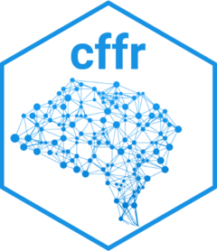
:::

<br><br>

-   Provide a license (ask your funder or PI)
-   Citation info in [`CITATION.cff`](https://citation-file-format.github.io/) or under `inst/CITATION`
-   Generation via `cffr`
-   Automatic transfer of metadata to archives
-   **Cite software in your publications**

## CI/CD meets FAIR

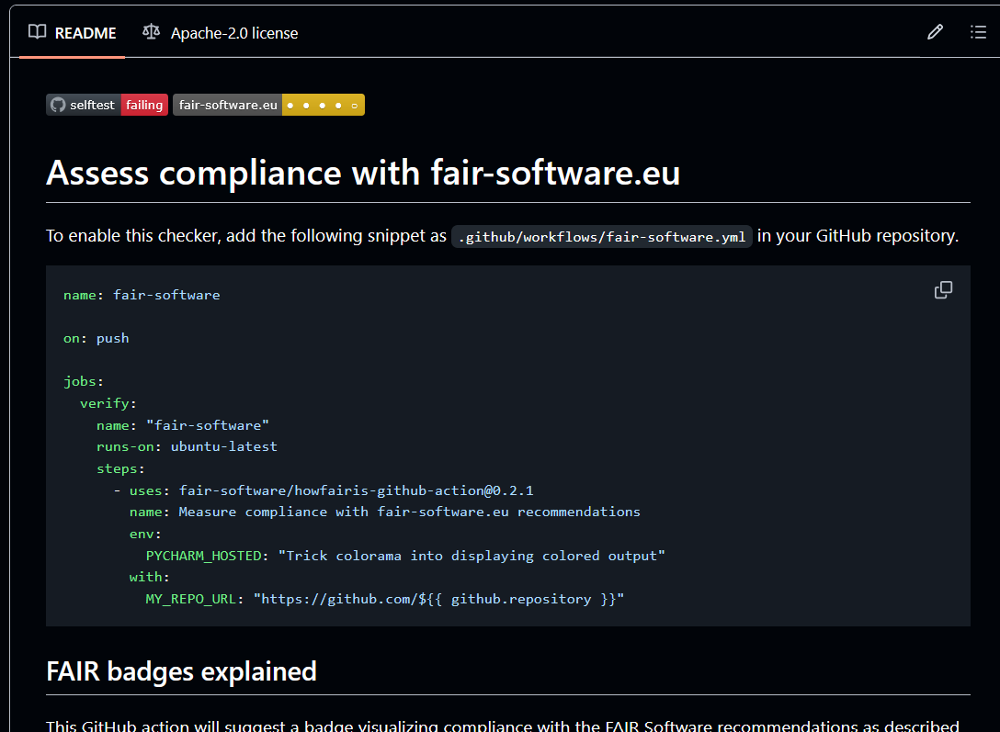

[howfairis GH action](https://github.com/fair-software/howfairis-github-action)

# Why packaging (scientific) code?

## Packages as scientific output

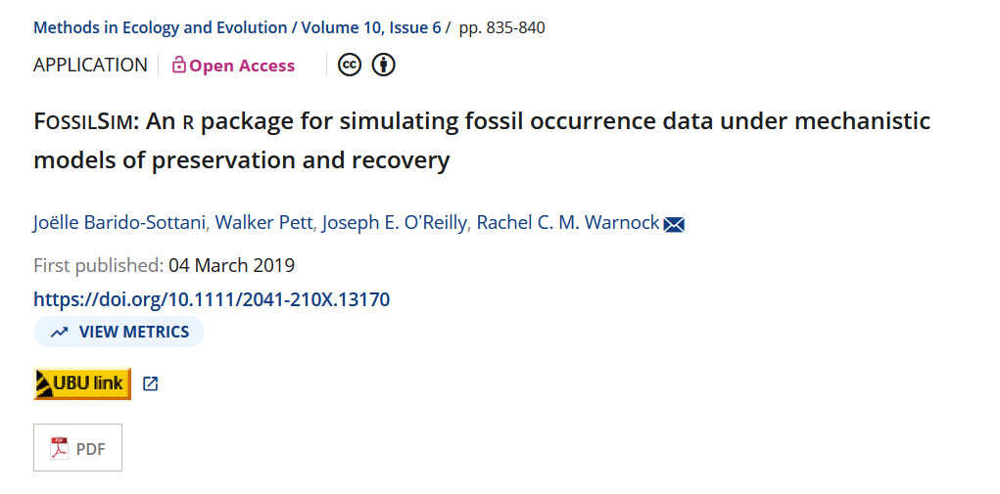

Software as part of Recognition & Rewards

## Packages as scientific output: ECR edition

Packages can be part of a dissertation (talk to your supervisor!)

Develop skills for a career outside of academia

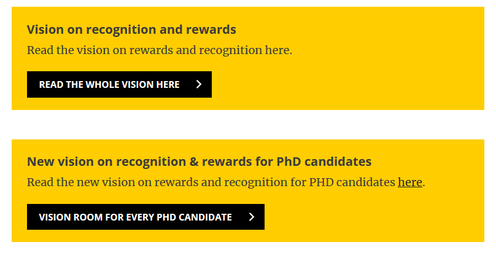

[UU page on R&R](https://www.uu.nl/en/research/open-science/tracks/recognition-and-rewards)

## Packages as scientific infrastructure

FAIR data and software as key component of Open Science

Increasing focus on software sustainability

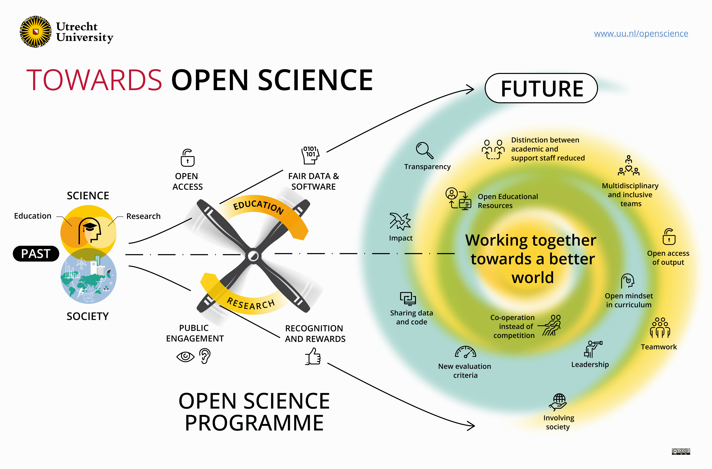

uu.nl/en/research/open-science

## Community engagement

-   Scientific communities are defined by the tools they use
-   Sharing these tools helps build a community and promote methodological approaches (e.g., [palaeoverse.org](https://palaeoverse.org/))

Minimum effort:

-   Write a CONTRIBUTING.md
-   Protocol for bug reports
-   Think of governance after end of project

## Website

```{r}
#| eval: false
#| echo: true
usethis::use_pkgdown()  # build page from docs & vignettes
usethis::use_pkgdown_github_pages() # publish on GH
```

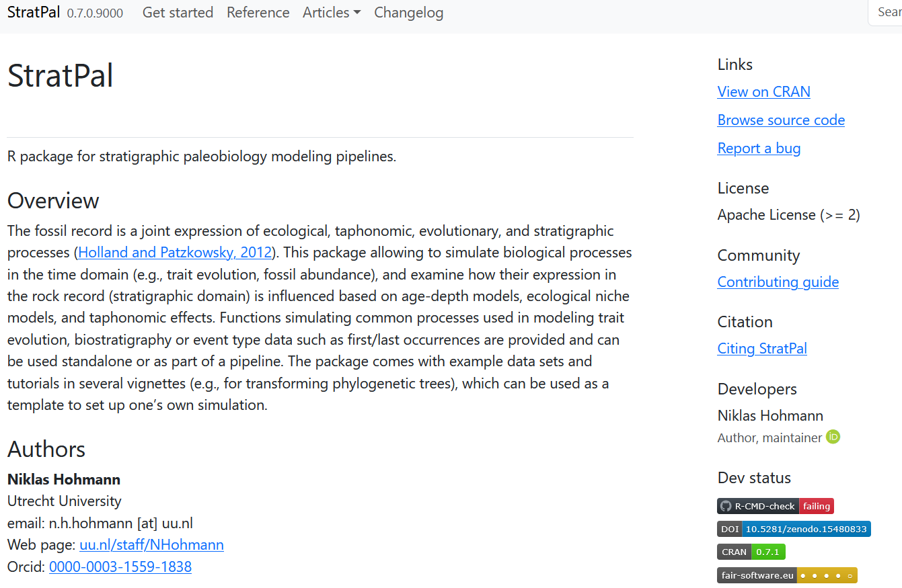

Combines documentation, vignettes, license, contribution guidelines, bug reporting and much more

## Downsides of packaging

-   Slower turnover
-   Development and maintenance overhead
-   Hard to get the community engaged & get contributions
-   Software as scientific output not internationally recognized

## Example: StratPal package

Links geosciences (stratigraphy) with biology (paleontology & phylogenetics)

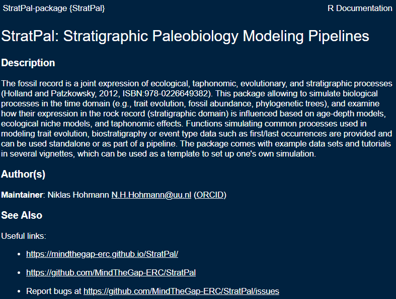

## StratPal publication

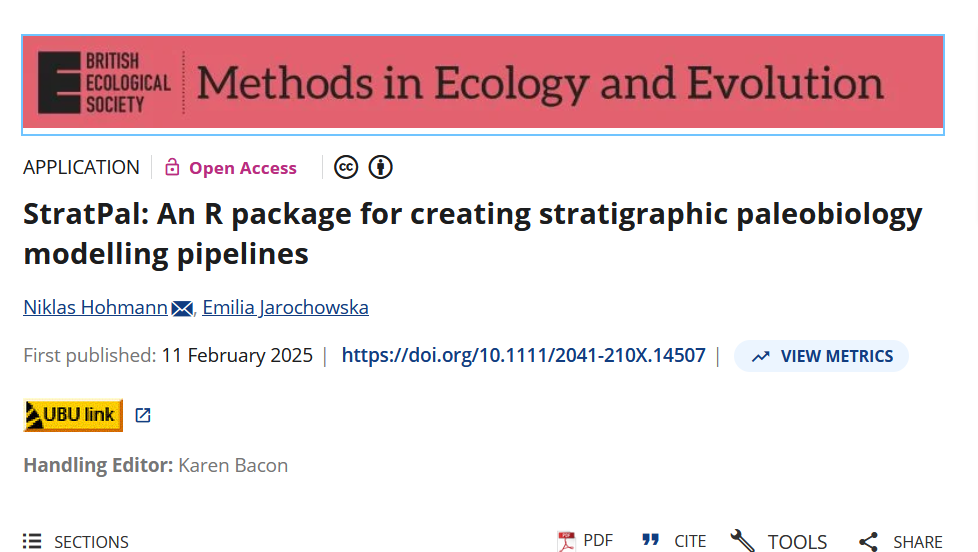

[DOI: 10.1111/2041-210X.14507](https://doi.org/10.1111/2041-210X.14507)

## Teaching materials

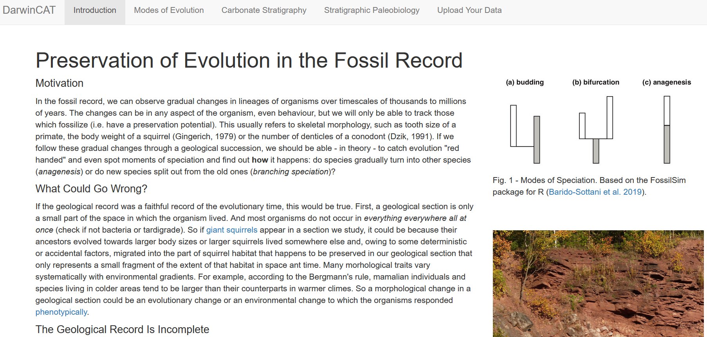

[Shiny App](https://utrecht-university.shinyapps.io/DarwinCAT/) + open educational resources

## Workshop materials

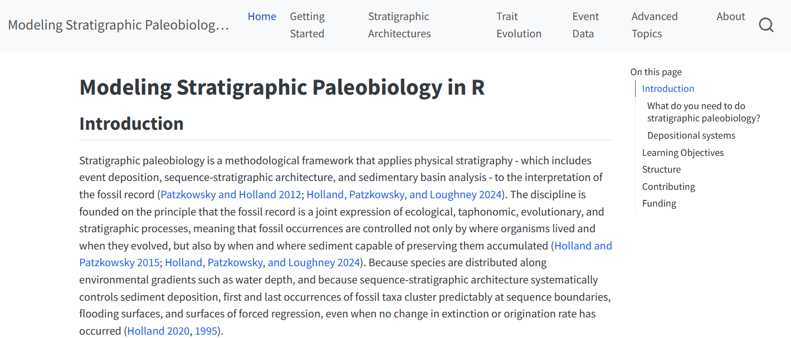

[Link](mindthegap-erc.github.io/StratPal_workshop_materials/)

## StratPal webpage


[Link](https://mindthegap-erc.github.io/StratPal/)

## Summary

-   Packaging is easy, with plenty of infrastructure available to reduce cognitive load
-   Package your scientific code to share code with collaborators and across publications and engage your community
-   Packages are standalone scientific outputs. Treat them with the same care as publications
-   Be aware of the overhead that comes with developing and **maintaining** packages

## Hands on

Got your own package?

-   FAIRify - add license, make webpage, link to Zenodo, release on GH, ... - whatever is most relevant to you

No package?

-   Get started under github.com/UtrechtUniversity/tutorial-r-package

# {data-background-color="#FFCD00"}

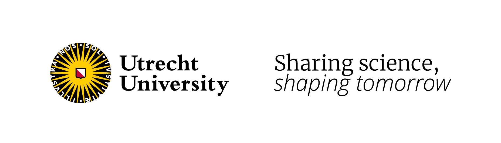
